# @genart-dev/plugin-atmosphere

Atmospheric effects for [genart.dev](https://genart.dev) — fog, mist, clouds, and haze layers with terrain masking and depth stacking. 37 presets across 4 categories, with 7 MCP tools for AI-agent control.

Part of [genart.dev](https://genart.dev) — a generative art platform with an MCP server, desktop app, and IDE extensions.

## Install

```bash
npm install @genart-dev/plugin-atmosphere
```

## Usage

```typescript
import atmospherePlugin from "@genart-dev/plugin-atmosphere";
import { createDefaultRegistry } from "@genart-dev/core";

const registry = createDefaultRegistry();
registry.registerPlugin(atmospherePlugin);

// Or access individual exports
import {
  ALL_PRESETS,
  getPreset,
  filterPresets,
  searchPresets,
  fogLayerType,
  mistLayerType,
  cloudsLayerType,
  hazeLayerType,
} from "@genart-dev/plugin-atmosphere";
```

## Layer Types (4)

| Layer Type | Category | Default Preset | Description |
|---|---|---|---|
| `atmosphere:fog` | Fog (5) | `morning-valley-fog` | Ground-level fog with terrain masking support, 4 fog types |
| `atmosphere:mist` | Mist (4) | `morning-mist` | Mid-level haze bands with parallax stacking and drift |
| `atmosphere:clouds` | Clouds (22) | `fair-weather-cumulus` | Sky-level formations with 20 cloud types, 3 algorithms, layered-tint shadowing |
| `atmosphere:haze` | Haze (6) | `light-haze` | Gradient atmospheric haze with 4 directions and noise modulation |

## Presets (37)

### Fog (5)

| Preview | ID | Name | Description |
|---|---|---|---|
| [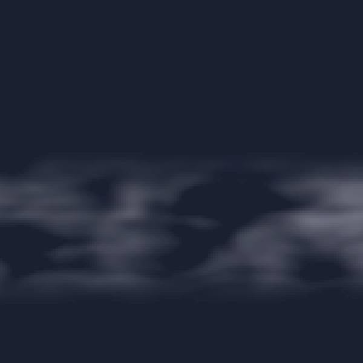](examples/fog/morning-valley-fog.png) | `morning-valley-fog` | Morning Valley Fog | Calm radiation fog settling in valleys at dawn |
| [](examples/fog/sea-fog.png) | `sea-fog` | Sea Fog | Dense advection fog rolling in from the coast |
| [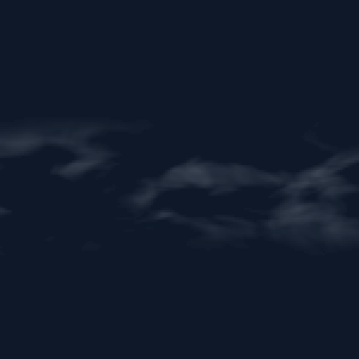](examples/fog/mountain-fog.png) | `mountain-fog` | Mountain Fog | Upslope fog clinging to mountain ridges, patchy and layered |
| [](examples/fog/dense-fog.png) | `dense-fog` | Dense Fog | Thick valley fog reducing visibility to near zero |
| [](examples/fog/patchy-fog.png) | `patchy-fog` | Patchy Fog | Scattered fog patches with terrain features visible between gaps |

### Mist (4)

| Preview | ID | Name | Description |
|---|---|---|---|
| [](examples/mist/morning-mist.png) | `morning-mist` | Morning Mist | Light haze bands creating gentle depth separation at dawn |
| [](examples/mist/mountain-haze.png) | `mountain-haze` | Mountain Haze | Layered blue-gray haze between mountain ridges |
| [](examples/mist/thick-mist.png) | `thick-mist` | Thick Mist | Heavy mist reducing visibility, strong atmospheric presence |
| [](examples/mist/layered-mist.png) | `layered-mist` | Layered Mist | Multiple distinct mist bands with strong parallax depth |

### Clouds (22)

| Preview | ID | Name | Description |
|---|---|---|---|
| [](examples/clouds/fair-weather-cumulus.png) | `fair-weather-cumulus` | Fair Weather Cumulus | Scattered puffy cumulus on a clear day, flat bases and rounded tops |
| [](examples/clouds/towering-cumulus.png) | `towering-cumulus` | Towering Cumulus | Large vertical cumulus with dramatic light and shadow |
| [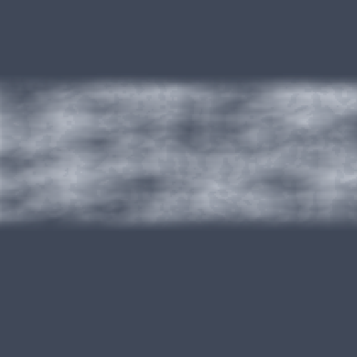](examples/clouds/overcast-stratus.png) | `overcast-stratus` | Overcast Stratus | Flat uniform cloud layer covering most of the sky |
| [](examples/clouds/stratocumulus-field.png) | `stratocumulus-field` | Stratocumulus Field | Regular field of rounded cloud patches with gaps |
| [](examples/clouds/wispy-cirrus.png) | `wispy-cirrus` | Wispy Cirrus | High-altitude ice crystal streaks, thin and translucent |
| [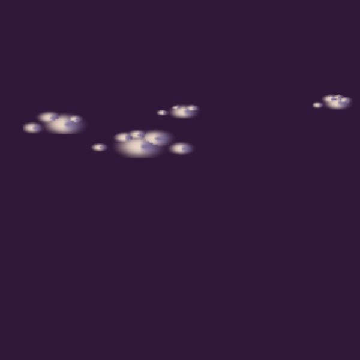](examples/clouds/sunset-cumulus.png) | `sunset-cumulus` | Sunset Cumulus | Cumulus clouds lit from below by warm sunset light |
| [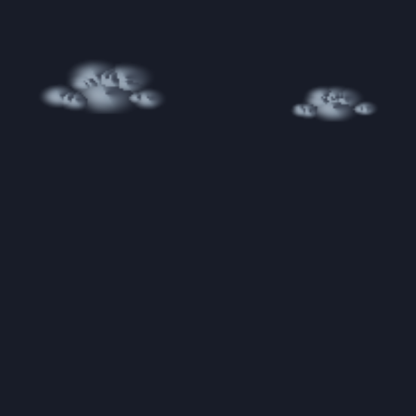](examples/clouds/storm-clouds.png) | `storm-clouds` | Storm Clouds | Dark heavy cumulonimbus with dramatic light contrast |
| [](examples/clouds/mackerel-sky.png) | `mackerel-sky` | Mackerel Sky | High-altitude cirrocumulus in a regular rippled pattern like fish scales |
| [](examples/clouds/cirrostratus-veil.png) | `cirrostratus-veil` | Cirrostratus Veil | Thin uniform high-altitude ice crystal veil creating a milky sky |
| [](examples/clouds/altocumulus-field.png) | `altocumulus-field` | Altocumulus Field | Mid-level cloud cells in a patchy field with rounded edges and blue gaps |
| [](examples/clouds/altostratus-sheet.png) | `altostratus-sheet` | Altostratus Sheet | Uniform mid-level cloud sheet filtering sunlight into a gray-blue sky |
| [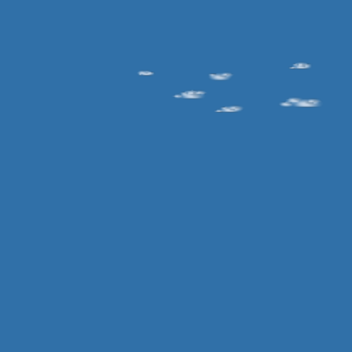](examples/clouds/castellanus-turrets.png) | `castellanus-turrets` | Castellanus Turrets | Small tower-like cumulus rising from a mid-level base, instability indicator |
| [](examples/clouds/cumulus-congestus.png) | `cumulus-congestus` | Cumulus Congestus | Tall towering cumulus with vigorous vertical development |
| [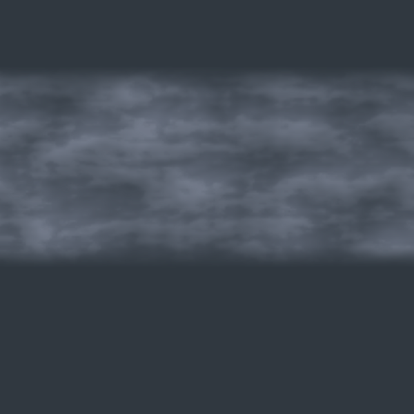](examples/clouds/nimbostratus-overcast.png) | `nimbostratus-overcast` | Nimbostratus Overcast | Dark thick low cloud layer covering the entire sky, continuous rain expected |
| [](examples/clouds/cumulonimbus-anvil.png) | `cumulonimbus-anvil` | Cumulonimbus Anvil | Massive thunderstorm cloud with flat anvil-shaped top spreading horizontally |
| [](examples/clouds/lenticular-lens.png) | `lenticular-lens` | Lenticular Lens | Smooth lens-shaped cloud formed by standing mountain waves, UFO-like |
| [](examples/clouds/mammatus-pouches.png) | `mammatus-pouches` | Mammatus Pouches | Inverted bulging pouch-like formations hanging below a cloud base |
| [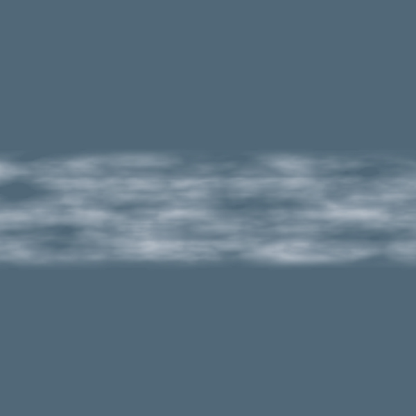](examples/clouds/fog-bank-low.png) | `fog-bank-low` | Fog Bank Low | Dense low-lying fog bank with sharp top edge, viewed from above |
| [](examples/clouds/contrail-thin.png) | `contrail-thin` | Contrail Thin | Thin straight aircraft contrail slowly spreading in upper atmosphere |
| [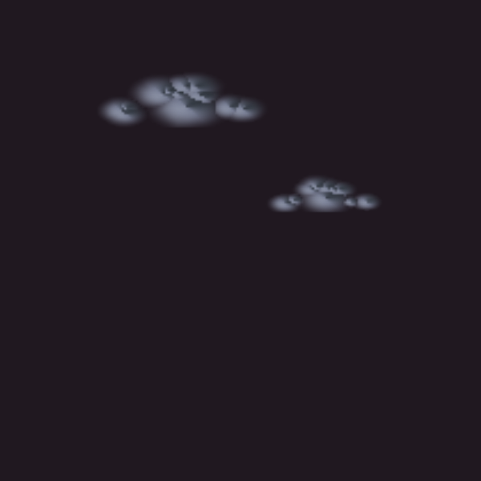](examples/clouds/pyrocumulus-dark.png) | `pyrocumulus-dark` | Pyrocumulus Dark | Fire-generated cumulus with dark smoky base and explosive cauliflower top |
| [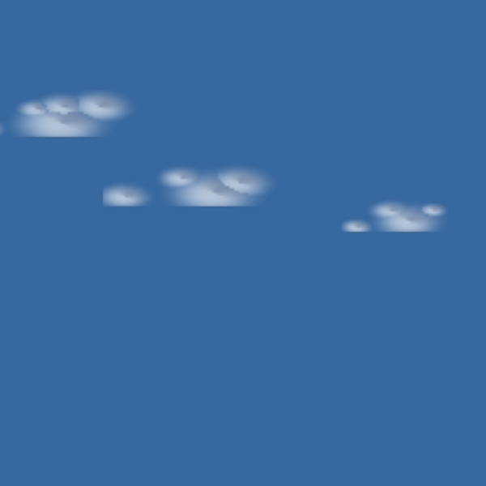](examples/clouds/banner-peak.png) | `banner-peak` | Banner Peak | Elongated cloud trailing from a mountain peak like a flag |
| [](examples/clouds/pileus-cap.png) | `pileus-cap` | Pileus Cap | Thin smooth cap cloud draped over the top of a growing cumulus |

### Haze (6)

| Preview | ID | Name | Description |
|---|---|---|---|
| [](examples/haze/light-haze.png) | `light-haze` | Light Haze | Subtle atmospheric haze softening distant elements |
| [](examples/haze/golden-haze.png) | `golden-haze` | Golden Haze | Warm golden atmospheric haze typical of golden hour lighting |
| [](examples/haze/cool-mist-haze.png) | `cool-mist-haze` | Cool Mist Haze | Cool blue-gray atmospheric haze for mountain depth |
| [](examples/haze/heat-haze.png) | `heat-haze` | Heat Haze | Shimmering heat haze rising from ground level |
| [](examples/haze/ink-wash-haze.png) | `ink-wash-haze` | Ink Wash Haze | Soft monochrome haze evoking Chinese ink wash painting depth |
| [](examples/haze/twilight-haze.png) | `twilight-haze` | Twilight Haze | Deep blue-purple atmospheric haze of late twilight |

## Mood Scenes (5)

The `create_atmosphere` MCP tool composes multi-layer scenes from curated preset combinations:

| Preview | Mood | Layers | Description |
|---|---|---|---|
| [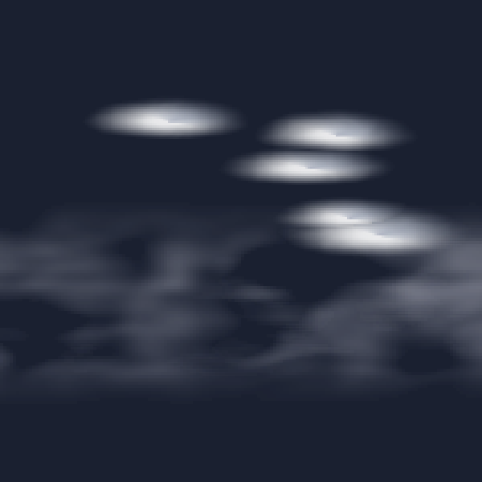](examples/scenes/calm-morning.png) | `calm-morning` | fog + mist + cumulus | Valley fog, morning mist bands, and fair-weather clouds |
| [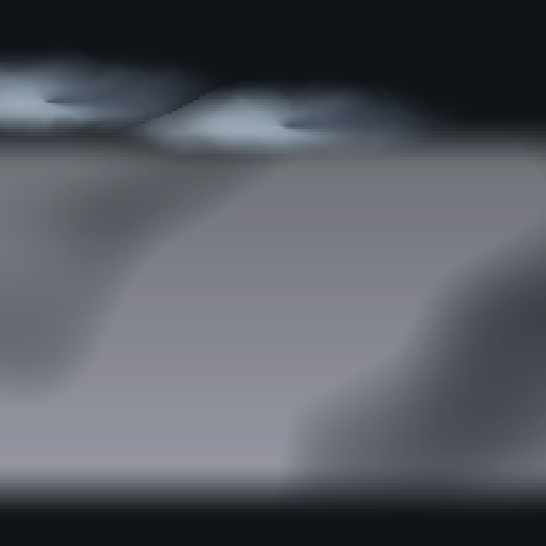](examples/scenes/dramatic-storm.png) | `dramatic-storm` | dense fog + storm clouds | Heavy fog with towering dark cumulonimbus |
| [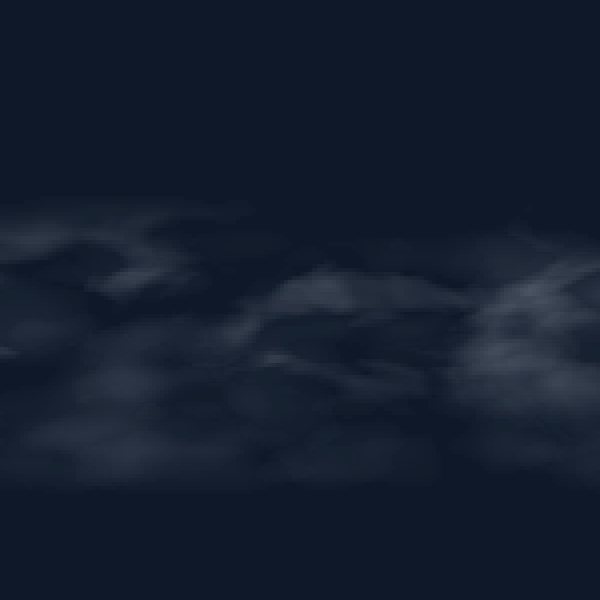](examples/scenes/misty-mountain.png) | `misty-mountain` | mountain fog + mist + haze | Upslope fog with blue-gray mountain haze layers |
| [](examples/scenes/clear-day.png) | `clear-day` | cumulus only | Scattered fair-weather cumulus on a blue sky |
| [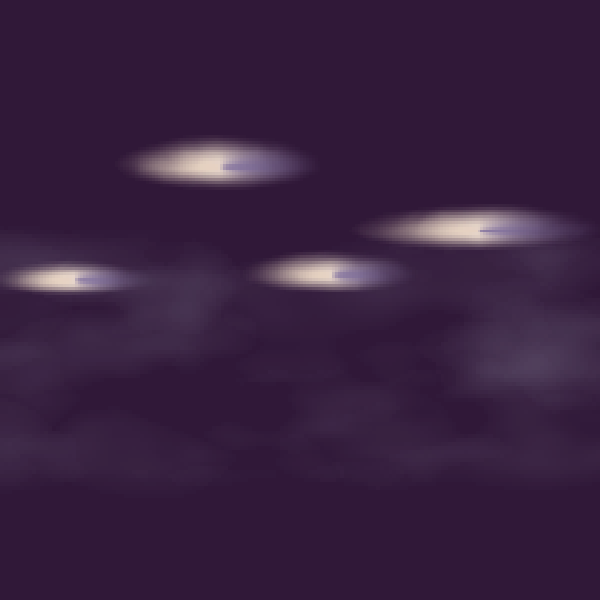](examples/scenes/golden-sunset.png) | `golden-sunset` | haze + sunset cumulus | Warm golden haze with sunset-lit cumulus layers |

## Rendering

Each layer type renders via canvas2d at reduced resolution for performance:

- **Fog** — Domain-warped fractal noise with patchiness control, vertical color gradient, fog-type modifiers (valley = denser at bottom, upslope = denser at top). 1/4 resolution.
- **Mist** — Multi-layer parallax noise bands with per-layer noise scale variation and drift offset. 1/4 resolution.
- **Clouds** — 20 cloud types via CloudFormation billow system, three rendering algorithms:
  - *Discrete*: Multi-lobe formations with layered-tint shadowing (3-pass: shadow/body/highlight)
  - *Threshold*: Warped noise field with Worley cellular blending and layered-tint shadowing
  - *Streak*: Continuous tapered strokes via perpendicular-distance rendering (cirrus, contrails, pileus)
- **Haze** — Gradient atmospheric color with 4 directions (bottom-up, top-down, center-out, uniform), noise-modulated density. 1/4 resolution.

## Terrain Masking (ADR 083)

Atmosphere layers are designed to work with the compositor masking system:

```typescript
// Fog masked by terrain:profile — fog is occluded by foreground terrain
layers.setMask(fogLayerId, terrainProfileId, "alpha");

// Mist behind terrain — mist only shows behind terrain ridges
layers.setMask(mistLayerId, terrainProfileId, "inverted-alpha");
```

The masking is handled by the compositor in `@genart-dev/core@^0.7.0`, not by the plugin itself.

## Depth Slot System

Every atmosphere layer has a `depthSlot` property (0-1) for front-to-back ordering:

- `0` = closest to viewer (foreground)
- `1` = farthest background (sky level)

Default values: fog = 0.2, mist = 0.6, clouds = 1.0.

## MCP Tools (7)

Exposed to AI agents through the MCP server when this plugin is registered:

| Tool | Description |
|---|---|
| `add_fog` | Add a fog layer by preset with optional overrides (fogType, density, color, opacity, fogLayers, wispDensity) |
| `add_mist` | Add a mist layer by preset with optional overrides (density, layerCount, color, skyColor, colorShift) |
| `add_clouds` | Add a cloud layer by preset or cloud type with optional overrides (cloudType, coverage, sunAngle) |
| `add_haze` | Add a haze layer by preset with optional overrides (color, opacity, gradientDirection, noiseAmount) |
| `list_atmosphere_presets` | List all presets, optionally filtered by category or search keyword |
| `set_atmosphere_lighting` | Set sunAngle and sunElevation across all cloud layers for consistent lighting |
| `create_atmosphere` | Compose a multi-layer atmospheric scene from 5 mood presets (now includes haze layers) |

## Utilities

Shared utilities exported for advanced use:

```typescript
import {
  mulberry32,                                          // Deterministic PRNG
  createValueNoise, createFractalNoise, createWarpedNoise, createWorleyNoise, // Procedural noise
  parseHex, toHex, lerpColor, varyColor,               // Color utils
} from "@genart-dev/plugin-atmosphere";
```

## Preset Discovery

```typescript
import { ALL_PRESETS, filterPresets, searchPresets, getPreset } from "@genart-dev/plugin-atmosphere";

// All 37 presets
console.log(ALL_PRESETS.length); // 37

// Filter by category
const fog = filterPresets("fog");       // 5 presets
const clouds = filterPresets("clouds"); // 22 presets
const haze = filterPresets("haze");     // 6 presets

// Full-text search
const results = searchPresets("storm"); // storm-clouds

// Look up by ID
const preset = getPreset("sunset-cumulus");
```

## Examples

The `examples/` directory contains 42 `.genart` files (37 individual presets + 5 mood scenes) with rendered PNG thumbnails.

```bash
# Generate .genart example files
node generate-examples.cjs

# Render all examples to PNG (requires @genart-dev/cli)
node render-examples.cjs
```

## Related Packages

| Package | Purpose |
|---|---|
| [`@genart-dev/core`](https://github.com/genart-dev/core) | Plugin host, layer system, compositor masking (dependency) |
| [`@genart-dev/mcp-server`](https://github.com/genart-dev/mcp-server) | MCP server that surfaces plugin tools to AI agents |
| [`@genart-dev/plugin-terrain`](https://github.com/genart-dev/plugin-terrain) | Sky, terrain profiles — provides masking sources for fog/mist |
| [`@genart-dev/plugin-particles`](https://github.com/genart-dev/plugin-particles) | Particle effects (snow, rain, fireflies) — pairs with atmosphere layers |
| [`@genart-dev/plugin-painting`](https://github.com/genart-dev/plugin-painting) | Vector-field-driven painting layers |
| [`@genart-dev/plugin-plants`](https://github.com/genart-dev/plugin-plants) | Algorithmic plant generation (110 presets) |
| [`@genart-dev/plugin-patterns`](https://github.com/genart-dev/plugin-patterns) | Geometric and cultural pattern fills (153 presets) |
| [`@genart-dev/plugin-compositing`](https://github.com/genart-dev/plugin-compositing) | Compositing tools including mask set/clear |

## Support

Questions, bugs, or feedback — [support@genart.dev](mailto:support@genart.dev) or [open an issue](https://github.com/genart-dev/plugin-atmosphere/issues).

## License

MIT
